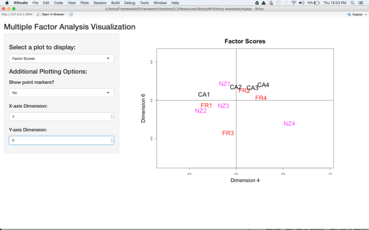
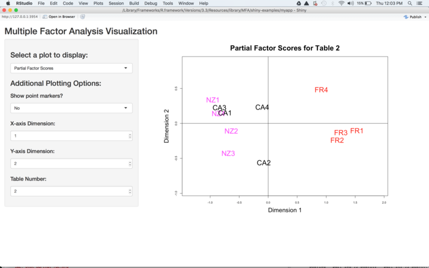
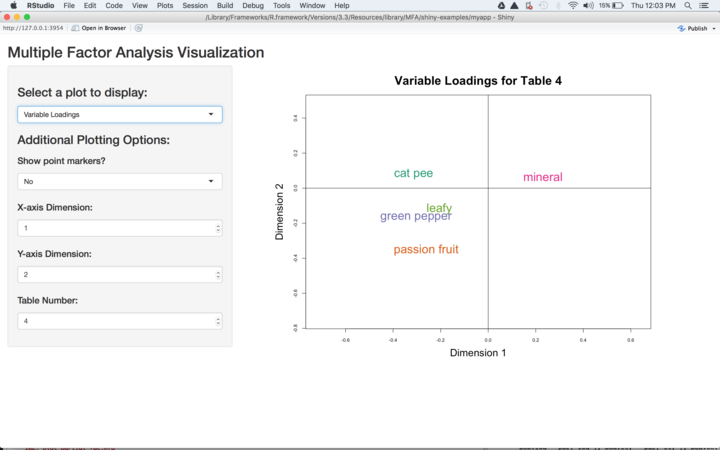
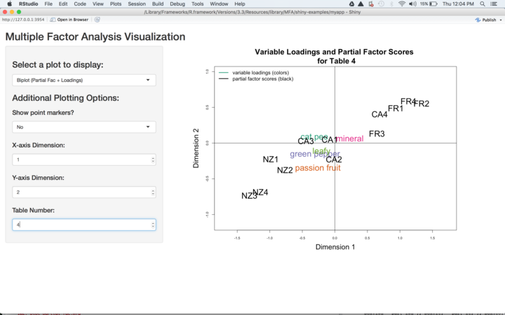
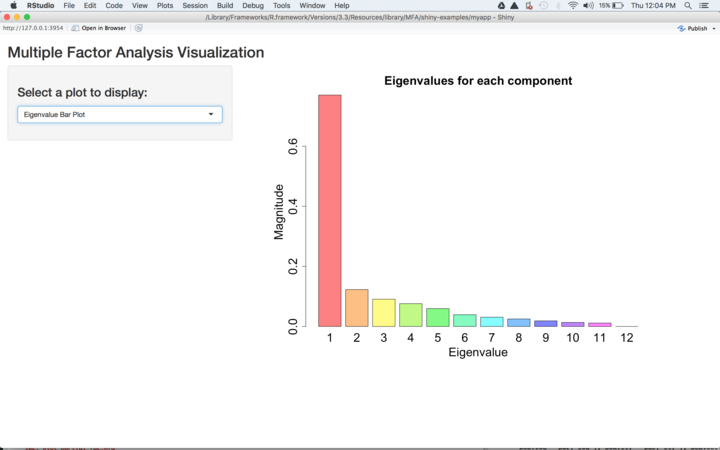
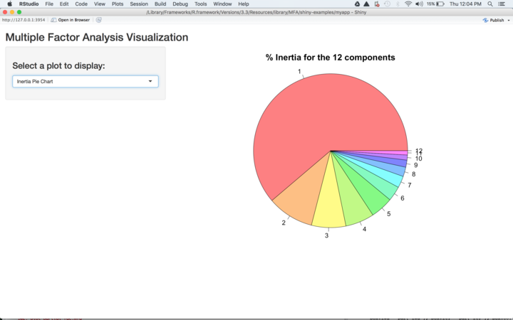

## Overview

Multiple Factor Analysis is a statistical method that expands the concept of principal component analysis to a multi-table data set. Principal component analysis (PCA) traditionally takes in one 2D data table of observations and variables and uses singular value decomposition (SVD) along with other analytical methods from linear algebra to perform dimension reduction on the data table, or in other words, compute a smaller number of new compound variables called 'components' which can describe the variation seen among the observations. This technique is useful because it gives the user insight into the underlying structure of the data table, or patterns in the data, that would be difficult to see without reducing dimensions. Multiple Factor Analysis takes this approach further by first doing SVD on each individual table to compute additional constraints for a second generalized SVD (GSVD) performed on a 'grand' data table made up of all individual tables-- in effect, allowing this 'grand' data table to itself undergo a form of PCA. A more detailed description of multifactor analysis and a step by step guide to the calculations performed in multifactor analysis can be found in reference 1. 

## Package contents

[The MFA constructor: mfa.R](#id1)

[The print method: print-mfa.R](#id2)

[The six plotting methods: plot_compromise.R, plot_ev.R, plot_loading.R, plot_biplot.R, plot_partial_fac.R, plot_inertia_pie.R](#id3)

[Additional descriptive statistics: lg.R, lg_table.R, rv.R, rv_table.R, obs_dim.R, var_dim.R, table_dim.R, bootstrap_factorscores.R](#id4)

[Load a toy data set to experiment with: loadWineData.R](#id5)

[Shiny App: runExample.R](#id6)

[References](#id7)

<a id="id1"></a> 

## The MFA constructor

The MFA constructor function (`mfa.R`) is the keystone of the package. It relies principally on two instances of R's built-in SVD function, as will be seen in the walk-through of this function below. 

MFA is intended for use on multi-table data sets, but for computational convenience, the user hands their raw data tables to `mfa.R` as a single matrix or data.frame along with a secondary input 'sets' which specifies how to divide the data back into individual tables. The user also defines how many factors to compute in the analysis with 'ncomps', and finally gives logical or numeric inputs to 'center' and 'scale' to define whether or not the function should perform centering and scaling for each active variable. The MFA constructor has in place careful checks for each of these types of input to safeguard against user error propagating into the analysis. Below is an example of how the check function ensures that the data inputs are in the right format:   

```{r, eval=FALSE}
check_inputs = function(data, sets, ncomps, center, scale) {
  if (!is.matrix(data) &
      !is.data.frame(data) ) {
    stop("'data' must be a matrix or data.frame containing the data set")
  }
...
}
```

After checking the inputs, the constructor function then partitions the raw data matrix into the list of tables specified by 'sets', and then scales and centers each table in that list. The resulting list of centered and scaled tables is called 'xTables' in the code. We then come to the first instance of SVD in the function, as each table is separately decomposed inside a for loop. These SVDs are performed by the code snippet below.  

```{r, eval=FALSE}
for (k in 1:length(xTables)) {
    val = svd(xTables[[k]])
    alpha[[k]] = (val$d[1]^-2)
    aVector = c(aVector, rep(alpha[[k]], ncol(val$u)) )
  }
```

The resulting 'alpha' object is a list of table weights computed from the first singular values of each table's SVD. These weights are propagated into the next SVD calculation via the object 'aVector', which stores these values in a vector which repeates each alpha value sequentially a number of times that matches the sizes of the individual tables. 'aVector' becomes one of two constraints on the next SVD calculation. The second constraint is a vector 'm' which represents a simple measure of 'observation masses' based on how many objects are included in the analysis, shown in the snippet below: 

```{r, eval=FALSE}
  nObs = nrow(xTables[[1]])
  m = rep(1/nObs, nObs)
```

With these two constraints in place, the individual 'xTables' are concatenated into a single matrix 'X', and the second instance of SVD can take place on 'X' within the imposed constraints. The GSVD of 'X' is shown in the code snippet below, along with comments reminding the user of which equation is being implemented in each step: 

```{r, eval=FALSE}
  # X = P \Delta Q^T
  xTilde = diag(m^(1/2)) %*% X %*% diag(aVector^(1/2))  # \tilde{X} = M^{1/2} A W^{1/2}
  xDecomp = svd(xTilde)  # \tilde{A} = P \Delta Q^T
  eigenvalues = (xDecomp$d)^2

  P = diag(m^(-1/2)) %*% xDecomp$u
  Q = diag(aVector^(-1/2)) %*% xDecomp$v
```

The remainder of the MFA constructor calculates common factor scores, partial factor scores, and matrix loadings from P, Q, and the individual table weights ('alpha') from before, and packages the final MFA object for output. The associated methods included in the package allow the user to explore this final output more fully. The following sections describe these methods. 

<a id="id2"></a> 

## The print method

Because there is a lot of information contained in the MFA object that a user might like to have easy access to, developing a good print method is a tricky task. If you flood the user with too much data, using the print method is not any better than just displaying the entire object. But giving too little data is also not useful. Therefore, our team developed a middle ground that combines automatic output with some reactive prompts that allow a user to define the amount of information that they are interested in. 

The print method (`print-mfa.R`) begins by giving the user a lot of information about the structure of their MFA object, and instructions on how to access each individual component of the MFA object in full, followed by a brief summary of key values and factor scores. Below is a sample of output from the print method, showing the parts that print automatically:   

```{r, eval=FALSE}
Summary of Multiple Factor Analysis (mfa) object: 
 
This object contains information on the data inputs as well as on the analysis outputs. 
You can access the full contents of any of these components using name_mfaObject$component_name.  
For example, if you are interested in viewing the eigenvalues for an mfa object called 'x', you would type 'x$eigenvalues'. 
 
Your MFA object contains the following items : 
################################################################################
           Component Name    ::    Description
################################################################################
                     data    ::    raw data input by user 
                     sets    ::    number of active variables across all the tables 
                   ncomps    ::    number of factors computed in the analysis 
                   center    ::    whether centering was performed on the data 
                    scale    ::    whether scaling was performed on the data 
              eigenvalues    ::    eigenvalues 
             factorScores    ::    common factor scores 
                    alpha    ::    table weights 
                  aVector    ::    vector of alphas 
      partialFactorScores    ::    partial factor scores 
           loadingByTable    ::    variable loadings (list form) 
           matrixLoadings    ::    variable loadings (matrix form) 
                        X    ::    the processed concatenated data table 
################################################################################

Number of tables considered in this multiple factor analysis: 10
Number of active variables: 53
Maximum Eigenvalue: 0.7702551
Common factor scores for first two components: 
         Dim1    Dim2
    1 : -0.98 : +0.16 
    2 : -0.81 : +0.03 
    3 : -0.76 : -0.45 
    4 : -1.11 : -0.17 
    5 : +1.37 : -0.13 
    6 : +1.26 : -0.11 
    7 : +0.81 : +0.20 
    8 : +0.93 : +0.41 
    9 : -0.67 : +0.37 
   10 : +0.07 : -0.76 
   11 : -0.48 : +0.51 
   12 : +0.37 : -0.08 

################################################################################
```

However, the partial factor scores and variable loadings represent a large amount of information that is difficult to summarize effectively. Each individual table will have its own matrix of partial factor scores and variable loadings, so even looking at only the first two components would return multiple tables at once. So to navigate these aspects, we constructed a set of prompts to allow the user to determine their preferences specifically. Below is a sample of output in answer to the variable loadings prompt. A similar prompt exists for viewing partial factor scores.

```{r, eval=FALSE}
################################################################################

Variable loadings:
################################################################################
If you would like to see variable loadings for a single table,
  enter the corresponding table number (1 through 10). 
 To see variable
  loadings for all tables, type ALL. 
 To skip seeing any variable loadings, type NONE (case-sensitive), or Return.1
Loadings for the first two components, showing table 1 of 10: 
         Dim1    Dim2
   V1 : -0.29 : +0.32 
   V2 : -0.27 : -0.25 
   V3 : -0.26 : +0.40 
   V4 : +0.24 : -0.18 
   V5 : +0.29 : +0.16 
   V6 : -0.23 : +0.13 
```

We chose to display only the first two components in each case, even when then 'ncomps' input is greater than two, because this ties in effectively with the plotting methods: the values returned represent the coordinates of the corresponding two-dimensional plot. For example, variable loadings along the first two dimensions for table 1 correspond to the coordinates of the 2D variable loadings plot for table 1. The various plotting methods will be discussed futher in the section below. 

<a id="id3"></a> 

## Six plotting methods 

Six plotting methods were developed for this package. 

Once you have installed this package, you should be able to produce all of the plots shown here by loading our sample wine data set. The code below demonstrates how to load the data set and more information on the the data set, and how to create your mfa object with the constructor function.

```{r, echo=TRUE}
library(MFA)

d <- loadWineData()
# also get some information on the wine data set such as wine names (obsnames) and variable names
varlabels <- loadWineInfo()$varkeys
obslabels <- loadWineInfo()$obskeys
obscolors <- loadWineInfo()$colors

s = list(  seq(2,7), seq(8,13), seq(14,19), seq(20,24),
           seq(25,30), seq(31,35), seq(36,39), seq(40,45),
           seq(46,50), seq(51,54) )
a = mfa(d, s)
```

`plot_compromise.R` generates a plot of the common factor scores. An example is shown below for the sample data set. This plot shows how the different objects in the data set (wines, four from each of three regions, New Zealand (NZ), France (FR), and California (CA)) vary over the first two dimensions (analogous to principal components) computed in the MFA. We can see that wines from each of the 3 regions seem to cluster together in this reduced-dimension space.   

At minimum, you should pass in your mfa object of interest to this method. There are several optional arguments to customize your plot. Here we use obsnames to pass in labels for our variables (in this case wine region + index), and textcolor to color our wines by region. "sz" and "cex"-prefixed arguments control the size of titles and labels. By default the first two components (dimensions) are used as the x and y dimensions, but one can use other dimensions with the arguments dim1 and dim2.

```{r, fig.cap="Compromise or common factor scores of the wine data set", fig.show='hold', fig.width=4, fig.height=4,echo=TRUE}
plot_compromise(a, obsnames = obslabels, textcolor = obscolors, 
                cexmain=0.9, cexaxis=0.6, cexlab=0.8, sz=0.8 )
```

`plot_partial_fac.R` generates a plot of the partial factor scores unique to each individual table, or in our case to each wine assessor. Below are plots of the partial factor scores for assessors 2 and 4. We can see that, as in the compromise for all assessors, the wines from each of the 3 regions seem to cluster together for these assessors as well. 

```{r, fig.cap="Partial factor scores for assessors 2 and 4", fig.show='hold', fig.width=7, fig.height=4, echo=TRUE}
par(mfrow=c(1,2))
plot_partial_fac(a, table = 2, obsnames = obslabels, textcolor = obscolors,
                 cexmain=0.9, cexaxis=0.6, cexlab=0.8, sz=0.8 )
plot_partial_fac(a, table = 4, obsnames = obslabels, textcolor = obscolors,
                 cexmain=0.9, cexaxis=0.6, cexlab=0.8, sz=0.8 )
```

`plot_loading.R` generates a plot of the variable loadings unique to each individual table. Below is an example of the variable loadings plots for assessors 2 and 4 from the wine data set. As we passed in labels for the observations before, we now have the option of passing in labels for the variables. In this example the variables correspond to characteristics in the wines' flavor profiles as detected by each assessor. 

```{r, fig.cap="Variable loadings for assessors 2 and 4", fig.show='hold',  fig.width=7, fig.height=4, echo=TRUE}
par(mfrow=c(1,2))
plot_loading(a, varnames = varlabels, table = 2, 
             cexmain=0.9, cexaxis=0.6, cexlab=0.8, sz=0.8 )
plot_loading(a, varnames = varlabels, table = 4, 
             cexmain=0.9, cexaxis=0.6, cexlab=0.8, sz=0.8 )
```

It is useful to view the loadings and partial factor scores on the same plot. For this purpose, we have `plot_biplot.R`. Below we show this for tables 2 and 4 again.

```{r, fig.cap="Variable loadings for assessors 2 and 4", fig.show='hold',  fig.width=7, fig.height=4, echo=TRUE}

par(mfrow=c(1,2))
plot_biplot(a, obsnames = obslabels, varnames = varlabels, table=2,
             cexmain=0.8, cexaxis=0.6, cexlab=0.8, sz=0.8,
             cexlegend = 0.6)
plot_biplot(a, obsnames = obslabels, varnames = varlabels, table=4,
             cexmain=0.8, cexaxis=0.6, cexlab=0.8, sz=0.8,
             cexlegend = 0.6)
```

`plot_ev.R` generates a bar graph of the eigenvalues computed in the MFA. We can see that the first eigenvalue is much larger than the others, indicating that most of the variation in this dataset is captured by the first component.

```{r, fig.cap="Eigenvalue magnitudes from mfa on the wine data set", fig.show='hold', fig.width=4, fig.height=4, echo=TRUE}
plot_ev(a)
```

And finally, `plot_inertia_pie.R` generates a pie chart showing the variance explained by each of the components, similar to the bar graph of the eigenvalues, but visualized in a different way. Again we see the relative importance of the first component.

```{r, fig.cap="Percent inertia contribution of each component in the wine data mfa", fig.show='hold', fig.width=4, fig.height=4, echo=TRUE}
plot_inertia_pie(a, radius=1, cexlab=0.7)
```


<a id="id4"></a> 

## Additional descriptive statistics

There are eight different methods included to explore further descriptive statistics related to the MFA output and the initial data input. 

As mentioned in the overview, the 'dimensions' (synonymous with 'components') generated by MFA are compound entities (we avoid saying 'variables' here to prevent confusion with the variables in the data set under consideration). These dimensions are influenced by the individual tables, objects, and variables from the underlying dataset to varying degrees. We have included three functions which allow the user to explore these contributions separately. 

`obs_dim.R` computes the contribution of each observation to each dimension. Below are the contributions of observations from the toy data set (in this case bottles of wine labeled by region+index) to the first four dimensions computed in the MFA. Each column sums to 1. Observations that are 'more important' to a particular dimension have larger values.         

```{r}
table<-obs_dim(a)

rownames(table) <- c('NZ1','NZ2','NZ3','NZ4',
               'FR1','FR2','FR3','FR4',
               'CA1','CA2','CA3','CA4')

colnames(table) <- c('dim1','dim2','dim3','dim4',
               'dim5','dim6','dim7','dim8',
               'dim9','dim10','dim11','dim12')

knitr::kable(table[,1:4])

```

`var_dim.R` computes the contribution of each active variable to each dimension. The output of `var_dim.R` is much larger than that of `obs_dim.R`, because each wine taster's view of a particular flavor note is considered a separate active variable, yielding 53 active variables in all. Thus, the output of `var_dim.R` is not demonstrated here, but, like `obs_dim.R`, each column sums to 1, and variables that are 'more important' to a particular dimension have larger values.

Because the original data set is comprised of multiple individual data tables, a third type of contribution can be computed, namely the contribution of each individual data table to each dimension (`table_dim.R`). Below are the contributions of each table from the toy data set (in this case 10 tables, one for each wine assessor) to the first four dimensions computed in the MFA. As before, each column sums to 1 and bigger values imply more importance for a particular dimension.          
```{r}
table<-table_dim(a)

rownames(table) <- c('Assessor 1','Assessor 2','Assessor 3','Assessor 4',
               'Assessor 5','Assessor 6','Assessor 7','Assessor 8',
               'Assessor 9','Assessor 10')

colnames(table) <- c('dim1','dim2','dim3','dim4',
               'dim5','dim6','dim7','dim8',
               'dim9','dim10','dim11','dim12')

knitr::kable(table[,1:4])

```

We have also included four closely related methods for examining between-table similarity. Two of these methods compute the Rv coefficient (`rv.R`) and Lg coefficient (`lg.R`), both of which are methods for quantifying the similarity between two data tables. The code snippet below demonstrates the usage of `lg.R`. The arguments are two individual tables from the raw toy data set, which have been stored together in the matrix 'd' and re-partitioned into separate data tables prior to running the `lg.R` function:   

```{r}

table1 = d[,seq(2,7)]
table2 = d[,seq(8,13)]
lg(table1,table2)

```

Both Lg and Rv coefficients range between 0 and 1, with higher values indicating closer relationship between the tables. The related functions `lg_table.R` and `rv_table.R` run this calculation for all data table pairs simultaneously, generating a diagonal matrix of results. Below is the output of `lg_table.R`, showing the relatedness of each table pair:   

```{r}
table<-lg_table(d,s)
rownames(table) <- c('Table1','Table2','Table3','Table4',
               'Table5','Table6','Table7','Table8',
               'Table9','Table10')

colnames(table) <- c('Table 1','Table 2','Table 3','Table 4',
               'Table 5','Table 6','Table 7','Table 8',
               'Table 9','Table 10')

knitr::kable(table)
```

And finally, we included a bootstrapping method to assess the representativeness of the computed common factor scores (`bootstrap_factorscores.R`). `bootstrap_factorscores.R` takes as input an MFA object and returns the mean of the bootstrap samples ('Fmean'), the standard deviations of the bootstrap samples ('Sig'), and finally the bootstrap ratios ('Tstar'). Tstar can serve as a measure of how "reliably" each observation contributes to a given dimension. In the code snippet below, we see the bootstrap ratios of each observation to the first 4 dimensions. For the first dimension, all but one of the wines contribute reliably (i.e., have a bootstrap ratio larger than +/-3 in magnitude). For dimensions 2 and onward, the pattern of contributions appears to be much less reliable, as shown by the small magnitudes of the bootstrap ratios.   

```{r}
boot<-bootstrap_factorscores(a)
table<-boot$Tstar
rownames(table) <- c('NZ1','NZ2','NZ3','NZ4',
               'FR1','FR2','FR3','FR4',
               'CA1','CA2','CA3','CA4')

colnames(table) <- c('dim1','dim2','dim3','dim4',
               'dim5','dim6','dim7','dim8',
               'dim9','dim10','dim11','dim12')

knitr::kable(table[,1:4])
```


<a id="id5"></a> 

## Toy data set 

We included in our package the toy data set that has been featured in the examples given in this vignette so that for the users can replicate these examples. The function `loadWineData.R` accesses the included dataset. Within `loadWineData.R`, a second function `loadWineInfo` loads more info on the dataset, such as labels for the variables and wines. See the plotting part of vignette for example of loading the data and including the labels in your plots. Reference 1 provides a detailed example using this same data set, as well as additional metadata for the the data set, which may be of interest to the user. 

<a id="id6"></a> 

## Shiny App

We also developed a shiny app to provide users a convenient platform to interactively explore the different visualizations created with the plotting methods. 

You can view a demo on YouTube here : https://www.youtube.com/watch?v=xsPIMDiTfro

To run the shiny app using the wine data set, use the block of code below, where a is the object created above in the plotting section of this vignette. Note that the app will use whatever mfa object is stored in the variable 'mfa_obj'. Additionally, the names 'active_var_names', 'active_obs_names', and 'active_col_vec' should be used respectively for labeling variables, labeling observations, and specifying colors to use for the observations. If you want to use the default labels (integers) and colors (black), make sure these variables are set to NULL.

```{r, eval=FALSE}
mfa_obj <- a #name needed for app
active_var_names <- loadWineInfo()$varkeys #name needed for app
active_obs_names <- loadWineInfo()$obskeys #name needed for app
active_col_vec <- loadWineInfo()$colors #name needed for app
MFA::runExample()
```


----
Upon running MFA::runExample(), the shiny app should pop up with the compromise (i.e. common factor score) plot displayed. Under "Additional plotting options" on the sidebar panel, you can change which components to use as the x and y axes with the numeric input boxes labeled "X,Y-axis Dimension". Additionally, with the widget labeled "Show point markers?" you can choose to display grey circles to mark the precise position of the variables in addition to the text labels. Below is the result after changing the X-axis dimension to 4 and the Y-axis dimension to 6. 

<center></center>

----
Select "Partial Factor Scores"" from the top control widget to see the partial factor scores plot. Now, under "Additional ploting options" you have the same options as the first plot, but you can additionally select which table you'd like to see. Below is the result after selecting table 2 and dimensions 1 and 2 for X,Y. 

<center></center>

----
Select "Variable Loadings"" to see where the variables lie for each table, in different dimensions. The plotting options are the same as for partial factor scores. Below is the loading for table 4, with axes corresponding to the first 2 components.

<center></center>

----
Select 'Biplot' to see both loadings and partial factor scores on the same plot. The plotting options are the same as for partial factor scores. Below is the biplot for table 4, with axes corresponding to the first 2 components.

<center></center>

----
Select 'Eigenvalue Bar Plot' to see this visualization. Note that there are additional plotting methods for this one.

<center></center>

----
Select 'Inertia Pie Chart' to see a visualization of the percent inertia contributed by each component.

<center></center>

----

Here is an example of how to run the app with random data and no variable/observation labels:

```{r, eval=FALSE}
# create a data set of random integers ranging from 50 to 100
nrows=14 #number of observations (like the wines)
nvars=33 #number of vars
# fill data with random integers between 50 and 100
d2 <- replicate( nvars, sample( 50:100, size=nrows, rep=TRUE ) )
# sets -- indexing into d2, so should cover range 1:nvars
s2 <- list( seq(1,4), seq(5,10), seq(11,19), seq(20,22),
            seq(23,30), seq(31,33) )
# create the mfa object with the random dataset
a2 <- mfa( d2, s2 )
# test run app with a2 object
mfa_obj <- a2 #name needed for app
active_var_names <- NULL #clear previous values so defaults will be used
active_obs_names <- NULL #clear previous values so defaults will be used
active_col_vec <- NULL #clear previous values so defaults will be used
# run the app
MFA::runExample()
```

<a id="id7"></a> 

## References 

[1] Abdi, H., Williams, L. J., & Valentin, D. (2013). Multiple factor analysis: principal component analysis for multitable and multiblock data sets. Wiley Interdisciplinary reviews: computational statistics, 5(2), 149-179.

[2] Pages, Jérôme. "Multiple factor analysis: Main features and application to sensory data." Revista Colombiana de Estadística 27.1 (2004): 1-26.

[3] Abdi, Hervé. "Singular value decomposition (SVD) and generalized singular value decomposition." Encyclopedia of measurement and statistics (2007): 907-912.
