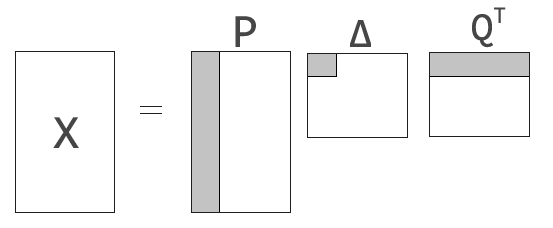
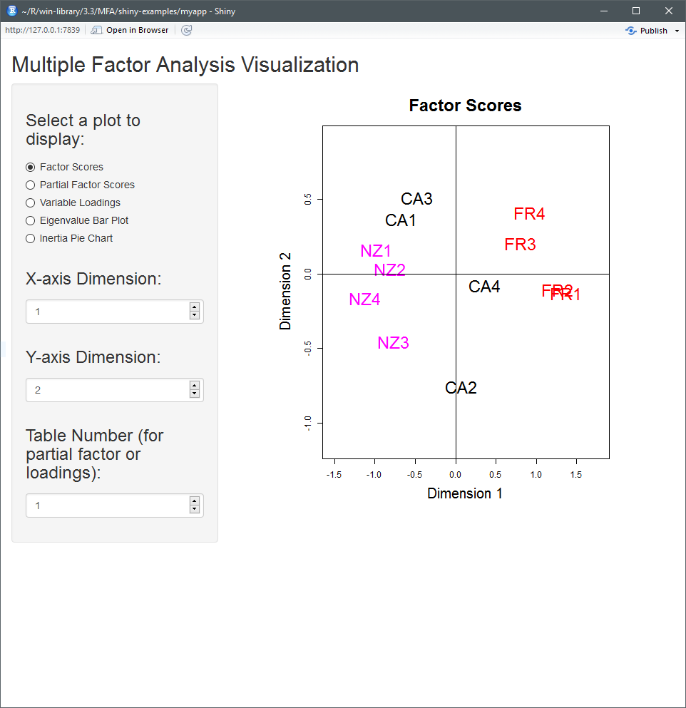
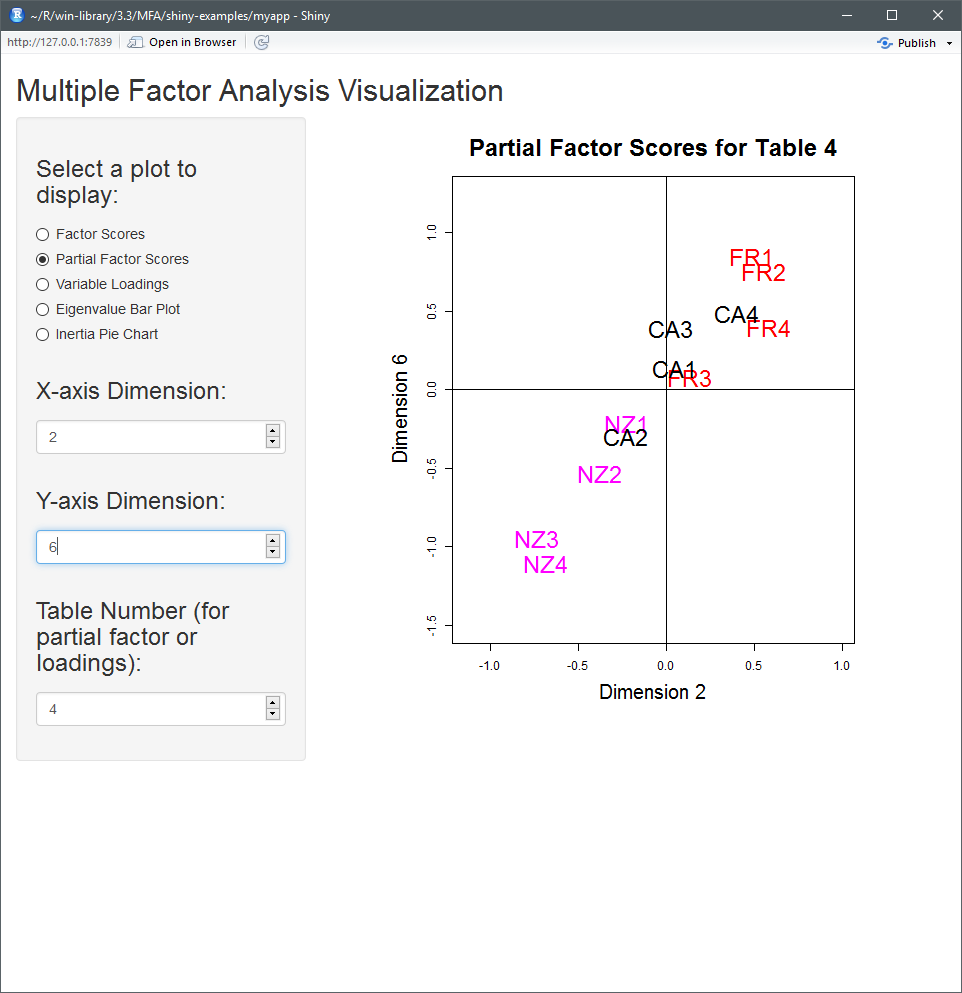
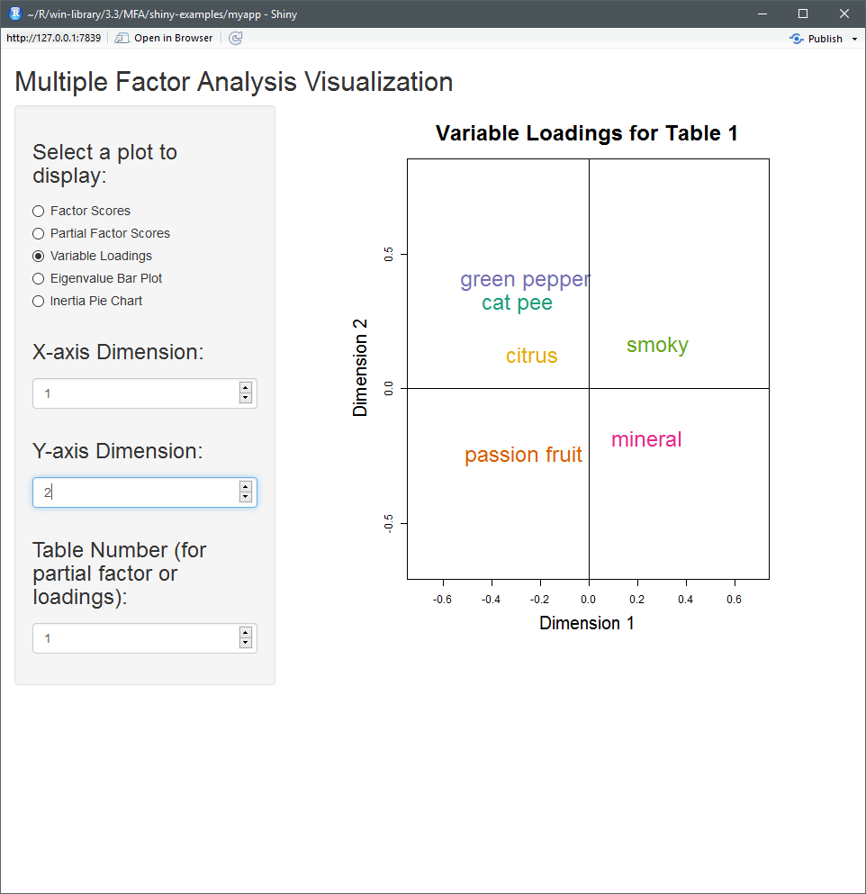
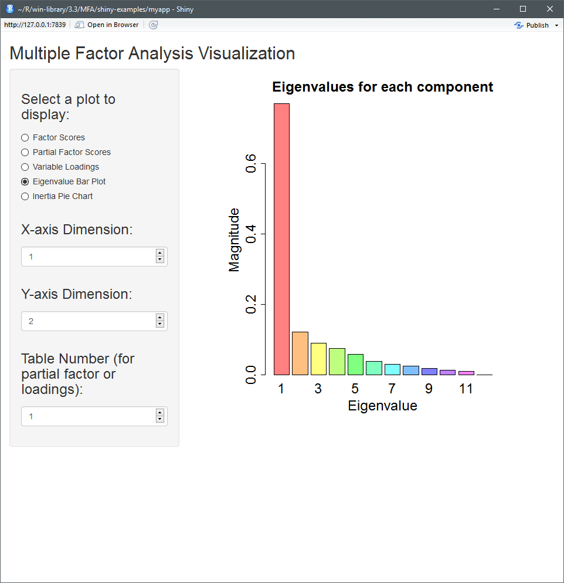

# What is Multiple Factor Analysis (MFA)? 

## What is MFA?

- Popular factorial method to study sets of variables that are collected on the same set of observations
- Generalization of principal component analysis (PCA)
- Provides factor loadings to indicate the impact of variables on components
- Factor scores (component scores in PCA) are returned to explain the effect of each observation on the factors
- Analysis provides a means of quantifying a level of agreement or disagreement between sets of variables

# Methodology
## Input Data
* Sets (or tables) of the same observations across different variables can be represented as:  
$$ Y = [Y_1, \ldots, Y_k] $$
* $k$ represents the number of sets to be included in the analysis  

* Each set contains _any_ number of variables


$$\{Y_1, \ldots, Y_k\} \in \mathbb{R}^{n \times m_i}\; \text{for}\; i = 1, \ldots k$$


* Sets can share or have their own unique variables 
    - the number of observations (rows) for each set needs to remain be the same

## Pre-processing

- Pre-processing of the $k$ tables can be completed by mean-centering and/or scaling each of the columns. We will represent the processed tables of $Y$ as: 

$$ X = [X_1, \ldots, X_k] $$

- $X_k$ is the centered and/or scaled representation of $Y_k$. 

- The concatenation of all centered and/or scaled tables is defined as $X$.

## Singular Value Decomposition

- We can decompose each set by using singular value decomposition (SVD): 
$$X_{[k]} = U_{[k]} \Gamma_{[k]} V_{[k]}^T$$
where,
$$
\begin{aligned}
X_{[k]} &\in \mathbb{R}^{n \times m} \;\; &U_{[k]} &\in \mathbb{R}^{n \times m} \\
\Gamma_{[k]} &\in \mathbb{R}^{m \times m} \; \; &V_{[k]} &\in \mathbb{R}^{m \times m} \\
U_{[k]}^T U_{[k]} &= I_{m \times m} \;\; & V_{[k]}^TV_{[k]} &= I_{m \times m}
\end{aligned}
$$
- Using the left singular vectors $U_{[k]}$, we can calculate a __factor score__ for each table: 
$$ G_{[k]} = U_{[k]} \Gamma_{[k]} $$


## Calculate $\alpha$

- Using the first singular value from each table $\gamma_{1,k}$ we can define $\alpha$ as: 
$$ \alpha_k = \frac{1}{\gamma_{1,k}^2} = \frac{1}{\lambda_{1,k}}$$ 

- $\lambda_{1,k}$ is the eigenvalue for the first singular value $\gamma_{1,k}$ 

- Each set has a weight, $\alpha_k$ which can be collected into a single vector $a$: 
$$ a = [\alpha_1 1_{[1]}, \ldots,  \alpha_k 1_{[k]}]$$ 
$a$ is a numVar-by-1` vector, where numVar is the number of variables in the analysis.  $\mathbb{1}_{[k]}$ is a vector of ones with a length equal to the number of variables of the $k$th table.

## Generalized Singular Value Decomposition

- We can decompose the concatenated matrix $X$ by using generalized singular value decomposition (GSVD) as follows: 
$$ X = P \Delta Q^T $$
where, 
$$ X \in \mathbb{R}^{n \times m},\;\; P,\Delta \in \mathbb{R}^{n \times n},\;\; Q^T \in \mathbb{R}^{n \times m}$$

<center></center>

## Generalized Singular Value Decomposition

- GSVD adds additional constraints in the form of:
$$ P M P^T = I, \;\; Q^T A Q = I$$

- $M = \text{diag}(m)$,  $M \in \mathbb{R}^{n \times n}$
    + $M$ is a mass matrix with $m_i$ assigned to each of the $i$ observations
    + For equal weighting across the observations, $m_i =\frac{1}{I}$ where $I$ is the number of observations
    
- $A = \text{diag}(a)$,  $A \in \mathbb{R}^{m \times m}$
    + weight matrix of $\alpha$ values (derived earlier) 

## Generalized Singular Value Decomposition 

To calculate $P$ and $Q$ we will need to define $\tilde{X}$:
$$ \tilde{X} = M^{1/2} X A^{1/2} \Longleftrightarrow X = M^{-1/2} \tilde{X} A^{-1/2}$$

Decomposing $\tilde{X}$ with SVD:
$$ \tilde{X} = U D V^T $$

The generalized eigenvector matrices for GSVD can be obtained by: 
$$ P = M^{-1/2} U  \;\;\;\; Q = A^{-1/2} V^T \;\;\;\; \Delta = D $$

## Factor Scores

- Utilizing the matrix decomposed by GSVD we can calculate the __factor scores__ by:
$$ F = P \Delta $$ 
where $P$ and $\Delta$ are from the GSVD decomposition. Each row of the factor score matrix represents an observation and each column is a component. 

- Projection of the $k$th table onto the compromise, is also known as the __partial factor scores__. Partial factor scores can be computed as:

$$ F_{[k]} = K \alpha_k X_{[k]} Q_{[k]}$$
where $K$ is the number total number of tables in the analysis, $\alpha_k = \gamma_{1,k}^{-2}$, $X_{[k]}$ is the $k$th table and $Q_{[k]}$ is the $k$th portion of the right eigenvector matrix. 

# R Package
## Installation

1) Install [devtools](https://github.com/hadley/devtools) if not already installed.
```
install.packages("devtools")
```

2) Load the devtools package: 
```
library(devtools)
```

3) Install from the github repository: 
```
install_github("oreluk/MFA")
```

## Features
- Enables a simple way to complete a multiple factor analysis 

- Eigenvalues, factor tables, loadings, R$_v$, and L$_g$ provide insight of the observations and variables 

- Provides visualization of the factor analysis by using biplots

- something else.. contributions?

# Demo
## Wine Tasting Dataset
- A set of wines were evaluated by a group of assessors

- Each assessors was asked to evaluate the wine on a 9-point scale using four variables (cat-pee, passion fruit, green pepper, and mineral)
    + An assessor could also include additional variables if they felt the need 

- Rows in this data set will indicate the the different types of wines that were evaluated, the observations

- Columns will represent the different variables of taste

- Each set (table) will be one assessors evaluation of the wines with their respective tasting variables

## Loading the data

- The function `loadWineData()` is used to load csv file into a data.frame. 
```
data <- loadWineData()
```
- A data.frame or table can be used as input to the MFA package

- Sets is used to partition the input data into sets (tables) by assessor. In this example we have 10 assessors indexed by their column number. 
```
sets <- list(  seq(2,7), seq(8,13), seq(14,19), seq(20,24),
           seq(25,30), seq(31,35), seq(36,39), seq(40,45),
           seq(46,50), seq(51,54) )
```
- Sets can either be a list of variable names or the column index. 

## Creating an MFA Object 

- To perform multiple factor analysis on the sets of data:
```
dsWine <- mfa(data, sets)
```
- `dsWine` is a __mfa__ object which has completed the mulitple factor analysis

- The command above is actually executing:
```
dsWine <- mfa(data, sets, ncomps = NULL, center = TRUE, scale = TRUE)
```

- where the following optional inputs are: 
    + __ncomps__: the number of components returned in the analysis
    + __center__: centering of each of the sets utilizing the R base function `scale()` 
    + __scale__: scales each of the sets by utilizing the R base function `scale()`


## View results 

Looking at the singular values, eigenvalues and their inertia:

```
eigenvalueTable(a)
```

```
                      [,1]       [,2]        [,3]        [,4]        [,5]        [,6]       
singularValues     0.8776418  0.3506073  0.30118188  0.27570882  0.24413253  0.19799790  
eig                0.7702551  0.1229254  0.09071052  0.07601535  0.05960069  0.03920317  
cumulative         0.7702551  0.8931806  0.98389110  1.05990645  1.11950714  1.15871031  
percentInertia    61.2296749  9.7716778  7.21082608  6.04266702  4.73782113  3.11636657  
cumulativeInertia 61.2296749 71.0013527 78.21217882 84.25484584 88.99266698 92.10903355 
```


## Factor Scores {.smaller}

- Factor scores can provide insight on which combination of factors underlie the observed data 

- Factor scores are a property of the  __mfa__ object. Looking at the first two components:

```
dsWine$factorScores[,1:2]

        [,1]   [,2]
 [1,] -0.980  0.163
 [2,] -0.809  0.033
 [3,] -0.761 -0.454
 [4,] -1.115 -0.166
 [5,]  1.373 -0.128
 [6,]  1.264 -0.108
 [7,]  0.808  0.205
 [8,]  0.925  0.408
 [9,] -0.669  0.369
 [10,]  0.073 -0.757
 [11,] -0.476  0.513
 [12,]  0.367 -0.076
```


## Partial factor scores and loadings 

- Partial factor scores and loading matrices are stored in the __mfa__ object. 
    + There are $N$ number of partial factor score matrices, where N is the number of sets (tables) in the analysis. The following code will return the partial factor score for the first table.

```
dsWine$partialFactorScores[1]
```

- Matrix loadings are the right singular vectors of the generalized singular value decomposition ($Q$). Loadings can be obtained by:  

```
dsWine$matrixLoadings
```

## Calculating R$_v$ and L$_g$ coeffient 

- The function ``rv(table1, table2)`` will calculate the R$_v$ coefficient: 
$$ R_{v_{k,\prime{k}}} = \frac{\text{trace} \left\{ \left(X_{[k]}X_{[k]}^T  \right) \times \left(  X_{[k^\prime]}X_{[k^\prime]}^T \right) \right\} } { \sqrt{\text{trace} \left\{ \left(X_{[k]}X_{[k]}^T  \right) \times  \left(X_{[k]}X_{[k]}^T  \right)  \right\}  \\ \times \text{trace} \left\{ \left(  X_{[k^\prime]}X_{[k^\prime]}^T \right) \times \left(  X_{[k^\prime]}X_{[k^\prime]}^T \right)   \right\} }  }  $$ 

- Similarly ``lg(table1, table2)`` is used to calculate the L$_g$ coefficient: 

$$L_{g(k,k^\prime)} = \frac{ \text{trace} \left\{ \left( X_{[k]} X_{[k]}^T \right)  \times \left( X_{[k^\prime]} X_{[k^\prime]}^T \right)   \right\}   }{ \gamma_{1,k}^2 \times \gamma_{1,k^\prime}^2}$$

## Bootstrap Factor Scores

- By sampling with replacement (bootstrap) we are able to get estimates of the variance of our factor scores. This function is available by using `bootstrap_factorscores(obj)` on a __mfa__ object. This function returns the bootstrap estimate of the factor score:

$$ \overline{F}^* = \frac{1}{L} \sum_\ell^L F_{\ell}^* $$ 

- Bootstrap estimate of the variance: 

$$ \hat{\sigma_{F^*}}^2 = \frac{1}{L} \left( \sum_\ell^L \left( F_\ell^* - \overline{F}^* \right) \circ \left( F_\ell^* - \overline{F}^* \right)  \right)$$

- Bootstrap ratios (Student's t statistic):  $T^* = \overline{F}^* / \hat{\sigma_{F^*}}$ 

# Shiny App

## Run Application

For the wine dataset labels are used for visualization:

```
mfa_obj <- dsWine
active_var_names <- loadWineInfo()$varkeys
active_obs_names <- loadWineInfo()$obskeys
active_col_vec <- loadWineInfo()$colors
MFA::runExample()
```

## 
<center></center>

##
<center></center>

## 
<center></center>

## 
<center></center>

## 

<center></center>

- Plots can be reproduced through the console by using the following methods:  `plot_compromise`, `plot_loading`, `plot_partial_fac`, and `plot_ev` 

## References
[1] Abdi, H., Williams, L. J., & Valentin, D. (2013). Multiple factor analysis: principal component analysis for multitable and multiblock data sets. Wiley Interdisciplinary reviews: computational statistics, 5(2), 149-179.

[2] Pages, Jérôme. "Multiple factor analysis: Main features and application to sensory data." Revista Colombiana de Estadística 27.1 (2004): 1-26.

[3] Abdi, Hervé. "Singular value decomposition (SVD) and generalized singular value decomposition." Encyclopedia of measurement and statistics (2007): 907-912.


